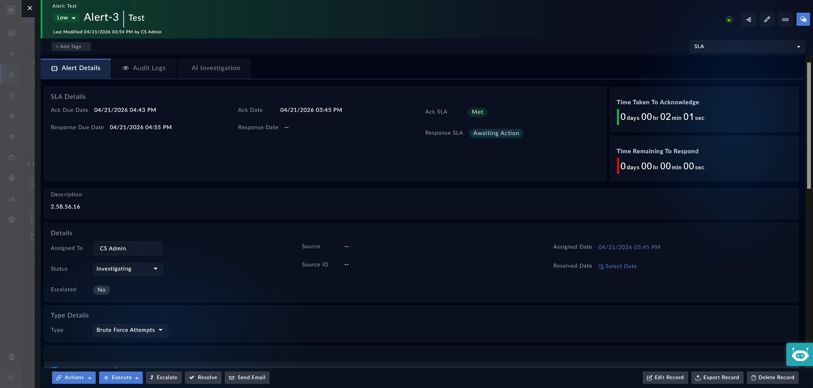

| [Home](../README.md) |
|----------------------|

# Installation

1. To install a widget, click **Content Hub** > **Discover**.
2. From the list of widget that appears, search for **SLA Count Down Timer**.
3. Click the **SLA Count Down Timer** widget card.
4. Click **Install** on the bottom to begin installation.

# Prerequisites

TThe **SLA Countdown Timer** depends on the following solution packs.

| Solution Pack Name | Version          | Purpose                                             |
|:-------------------|:-----------------|:----------------------------------------------------|
| SLA Management     | v2.0.0 and later | Required for SLA Calculation and managing the timer |

>[!IMPORTANT]
>
> The SLA Management solution pack must be installed before the widget can be configured and used.
>

# Configuration

To configure the **SLA Countdown Timer** widget, perform the following steps:

1. Click an alert to launch its detailed view.

    

2. Click the icon **Edit Template** <picture><source media="(prefers-color-scheme: dark)" srcset="./res/icon-edit-light.svg"></picture> on the top right.

3. Click the button <picture><source media="(prefers-color-scheme: dark)" srcset="./res/icon-add-light.svg"></picture> **Add Widget**, to add a widget.

4. Select **SLA Countdown Timer** from the list of widgets.

The following table lists the various fields and acceptable values on the widget configuration screen.

- **Title**: Specify the title of the **SLA Countdown timer**. For example: *Time Remaining To Respond*.

- **SLA Due Date**: Select an appropriate option from the drop-down to set the countdown timer to the SLA due date. For example: *Response Due Date*.

- **SLA Completion Date**: Select an appropriate option from the drop-down to set the countdown timer to the SLA completion date. For example: *Ack Date*.

- **SLA Paused Date**: Select an appropriate option from the drop-down to set the countdown timer to the SLA paused date. For example: *Ack SLA Paused Date*.

- **Pause Clock**: Define a condition when the countdown timer should be paused. For example: *When* `Ack SLA` *is set to* `Paused` *then set title to* `Ack SLA Paused`.

- **Stop Clock**: Define a condition when the countdown timer should be paused. For example: *When* `Ack SLA` *is set to* `Met` *then set title to* `Time Taken To Ack`.

- **And Set Title To**: Once the countdown timer has been stopped, this field represents the countdown title that should be displayed.

- **Show: Remaining Time**: Select this option to show time remaining until the acknowledgment SLA is breached.

- **Show: Consumed Time**: Select this option to show time taken to acknowledge the alert.

## Next Steps

| [Usage](./usage.md) |
|---------------------|
