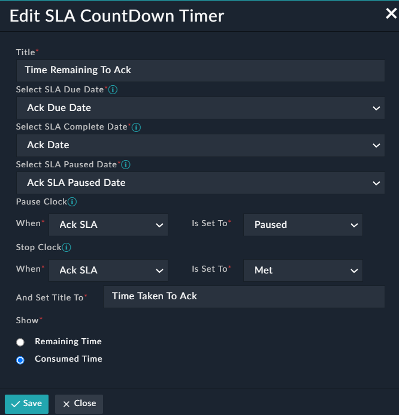
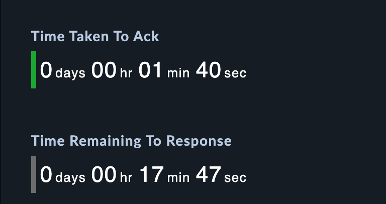

| [Home](../README.md) |
|----------------------|

# Usage

SLA Count Down Timer:
Sets a count down timer which displays time remaining for SLA breach. Allows to display time remaining or consumed after SLA is acheived, based on setting
- SLA Due Date
- SLA Complete Date
- Condition to stop and pause timer
- Show "Remaining time" or "Consumed time"

## SLA Count Down Timer Widget Edit View

This section details the process to edit the widget and use it with data from a specific record.

#### Appearance

The following image shows Sla Count Down Timer in detailed view.

| [Installation](./setup.md#installation) | [Configuration](./setup.md#configuration) |
|-----------------------------------------|-------------------------------------------|