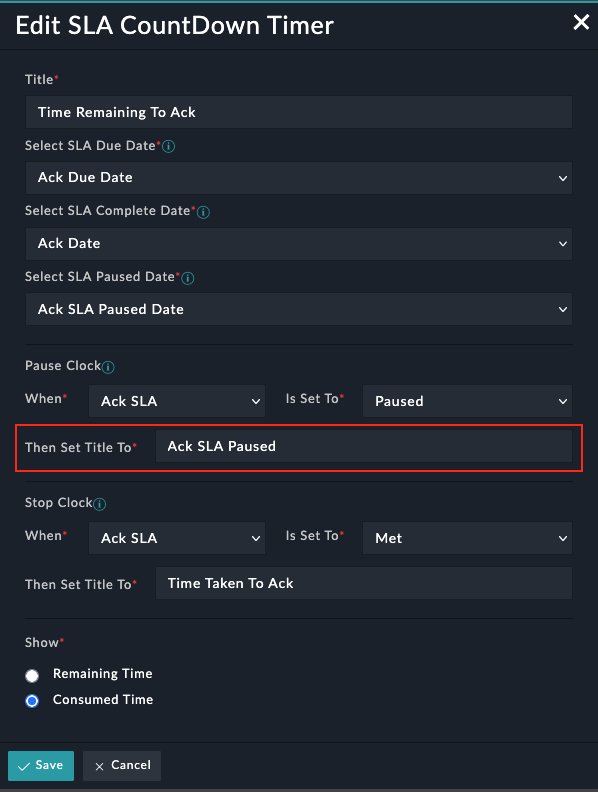

# What's Fixed
- Added new configuration field to set widget title to be displayed on Paused SLA.

**Note:** In order to this widget work properly it is necessary that you should have SOAR Framework v4.0.0 deployed on your system. If not, then you need to updated the widget configuration manually and added text to be displayed in below field highlighted in screenshot

